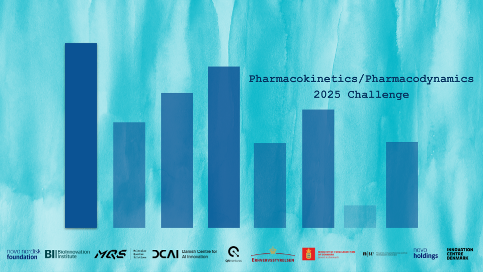
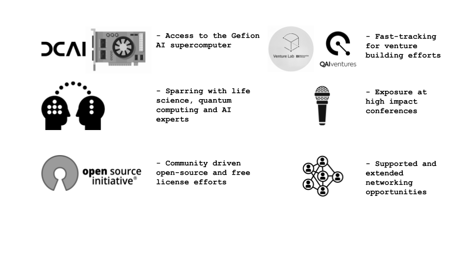
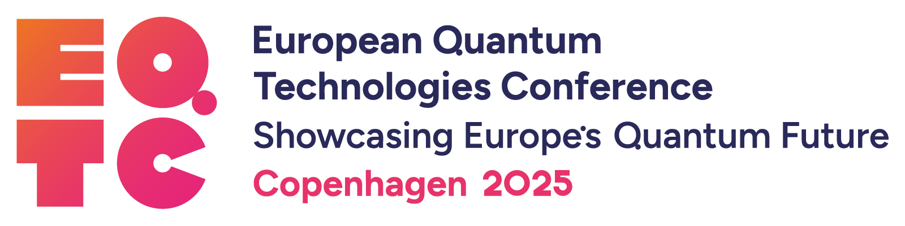

{% assign current_date = 'now' | date: "%Y-%m-%d" %}
{% assign event_start_date = site.event_start_date | date: "%Y-%m-%d" %}
{% assign event_close_date = site.event_close_date | date: "%Y-%m-%d" %}
{% assign registration_opens_date = site.registration_opens_date | date: "%Y-%m-%d" %}
{% assign registration_closes_date = site.registration_closes_date | date: "%Y-%m-%d" %}


    

    

    



    

    

    


{:.secondary}

    

    <h2><i class="bi bi-calendar3"></i> Timeline</h2>
    <dl>
        
            <dt>{{ site.registration_opens_date }}</dt>
            <dd>
                Applications open for participants 
                
                    <button class="btn" onclick="openRegistrationModal()">Register your team</button>
                     
                    It is needed to register your team by sending us the names of your team members and the hosting letter.
                     
                    <a href="https://quantum-innovation-challenge.github.io/projects/" class="btn">Read about the challenge</a>
                     
                    <a href="https://matrix.to/#/#mqs-community-space:mozilla.org" class="btn">Find team members via Element Space</a>
                
                    <a class="btn disabled">Registration has closed</a>
                
                    <a class="btn disabled">Registration opens soon</a>
                
            </dd>
        

        <dt>{{ site.registration_closes_date }}</dt>
        <dd><b>Phase I</b>
         
        - Submission of the projects closes on the 30th of September at 10AM Central European Time (CET).
         
        - Evaluation will be conducted from the 1st until the 15th of October.</dd>
         
        <dt>{{ site.event_date }}</dt>
        <dd><b>Phase II</b>
         
        - The top five teams are invited to present at the <a href="https://eqtc2025.ku.dk/">European Quantum Technologies Conference 2025 (EQTC)</a> in Copenhagen (10-12 November).
         
        - Travel costs and accomodation for all teams are sponsored and will be covered.
         
        - Scheduled access to Gefion after EQTC until end of January 2026 (Phase III).</dd>
         
        <dd><b>13 November 2025 - 31 January 2026</b>
         
        <b>Phase III</b>
         
        - Finalization of the projects until the 31st of January 2026.
         
        - The presentations and the winner announcement will be held at a leading quantum computing conference in spring 2026.
         
        - A prize is offered for the final winning team in the form of extended free access to the Gefion AI supercomputer, sponsored by DCAI.
        </dd>
    </dl>

## Accelerating Quantum Applications in the Life Sciences

The Quantum Innovation Challenge 2025 invites researchers, start-ups, and students from around the world to explore how quantum computing and quantum-inspired algorithms can advance (bio)pharmaceutical innovation – offering selected teams exclusive access to the Gefion AI Supercomputer.

With the emergence of near-term quantum computers and powerful GPU-based methods, there is a growing need to understand their strengths and limitations, reduce barriers to adoption, and apply them to real-world problems in drug development. This virtual challenge is designed to foster collaborative, open research that contributes to this mission.

## Your Role

Academic/industrial researchers, start-ups and students can propose projects with respect to this year's [challenge topic](_/../projects.md) applying quantum computing and quantum-inspired algorithms to:

- existing benchmarks or new benchmarks as further defined by the [Quantum Challenge 2025 topic](./../projects.md)
- creating sub-algorithms based on quantum computing methods
- designing quantum-enhanced sampling and optimization techniques

Following the challenge, results will be collated and secured under open-source and free license agreements (Apache/MIT) in the dedicated Quantum-Challenge-2025 repository.

## Who can participate?

The challenge encourages cross-disciplinary and international collaboration. It is open to teams of academic and industrial researchers, start-ups, and students who are interested in using quantum computing and quantum-inspired methods to advance pharmaceutical development.

To be eligible for submission:

- Each team must include at least one clearly documented academic participant in a main role
- Teams should have prior programming experience and basic familiarity with git and GitHub
- Full eligibility details are available on the [Eligibility page](_/../eligibility.md)

Support and participation resources:

- Participants are welcome to connect and form teams using our dedicated [Element Space](https://matrix.to/#/#mqs-community-space:mozilla.org) (see also [https://element.io](https://element.io))
- Orientation materials and technical guidance are available on the [Resources page](./../resources.md)
- Pre-registrations and questions can be sent to <a href="mailto:quantum_challenge@mqs.dk">quantum_challenge@mqs.dk</a>. All inquiries will be addressed collectively on the [FAQ page](./../faq.md)

    
## Why participate?

    

- Five teams will be selected to present their work at the [European Quantum Technologies Conference 2025 (EQTC)](https://eqtc2025.ku.dk/) in Copenhagen.
- After the announcement of the finalists at EQTC in November, the 5 finalists gain access to the GEFION Supercomputer to continue the development of their models. Submission deadline for the second phase is expected to be end of January 2026 with announcement of the final winner in Q1 2026.
- The winning solution will be announced in Spring 2026 during another leading European quantum event and a prize is offered for the final winning team in the form of extended free access to the Gefion AI supercomputer, sponsored by DCAI.
- Networking and access to a global community of experts from the academic and industrial life science community.
- Working on a relevant life science use case with feedback and mentoring from leading industry partners, investors, and experts.
- Direct access and support from Gefion, one of the fastest supercomputers globally, to run your challenge code (5 finalists).
- Global marketing and branding with free tickets to EQTC 2025, presentation opportunities and further fostering of relationships (5 finalists).
- Novo Holdings and QAI Ventures will help to facilitate access to their global investor network.
- Onboarding to the global QAI Ventures ecosystem with 1 year of exclusive 1:1 mentoring from investment and technology experts and a ticket to the QAI Ventures speed dating session to join upcoming venture building or accelerator programs (top 3 teams).

Do not miss this opportunity to engage in quantum innovation at the frontier of life sciences.

📅 Visit the [Agenda page](./../agenda.md) to view the full timeline.

## Submitted Projects

The top-ranked projects will be highlighted here:

| Rank | Project #                                            | Team Name | Project Name |
| ---  | ---------------------------------------------------- | --------- | ------------ |
| 1st  |                                                  |           |              |
| 2nd  |                                                  |           |              |
| 3rd  |                                                  |           |              |
| 4th  |                                                  |           |              |
| 5th  |                                                  |           |              |

For a full list of the submitted challenge projects, we encourage you to take a look at the [Challenge page](_/../projects.md).

## Partners

    
    

 

    
    

    
        

 

    
    

 

    
     

 
 
The 2025 challenge is supported by industry experts from Novo Nordisk A/S and Roche Holding AG:

    
    

For further information see the list of experts on the [about page](_/../about.md).

## Financial Sponsors

- [Novo Nordisk Foundation](https://novonordiskfonden.dk/)
- [Danish Business Authority](https://danishbusinessauthority.dk/)

[faq]: {{ site.baseurl }}

<!-- Registration Modal -->

  

    &times;
    <h2>Register Your Team</h2>
    
    <form id="registrationForm" enctype="multipart/form-data">
      

        <label for="team_member_1_name">Team Member 1 Name *</label>
        <input type="text" id="team_member_1_name" name="team_member_1_name" required>
      

      
      

        <label for="team_member_1_email">Team Member 1 Email *</label>
        <input type="email" id="team_member_1_email" name="team_member_1_email" required>
      

      
      

        <label for="team_member_2_name">Team Member 2 Name *</label>
        <input type="text" id="team_member_2_name" name="team_member_2_name" required>
      

      
      

        <label for="team_member_2_email">Team Member 2 Email *</label>
        <input type="email" id="team_member_2_email" name="team_member_2_email" required>
      

      
      

        <label>Additional Team Members</label>
        

          <!-- Additional members will be added here dynamically -->
        

        <button type="button" class="btn btn-secondary" onclick="addTeamMember()" style="margin-top: 10px;">+ Add Team Member</button>
      

      
      

        <label for="additional_notes">Additional Notes</label>
        <textarea id="additional_notes" name="additional_notes" placeholder="Our team is excited to participate in the quantum challenge!"></textarea>
      

      
      

        <label for="pdf_document">Hosting Letter (pdf; optional), please send before submission of your project</label>
        <input type="file" id="pdf_document" name="pdf_document" accept=".pdf">
      

      

        <input type="text" id="email_honeypot" name="email_honeypot">
      

      
      

        <button type="submit" class="btn">Submit Registration</button>
        <button type="button" class="btn btn-secondary" onclick="closeRegistrationModal()">Cancel</button>
      

    </form>
  

