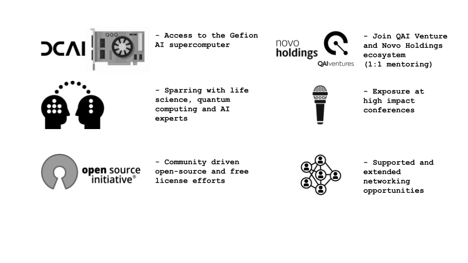

{% assign current_date = 'now' | date: "%Y-%m-%d" %}
{% assign event_start_date = site.event_start_date | date: "%Y-%m-%d" %}
{% assign event_close_date = site.event_close_date | date: "%Y-%m-%d" %}
{% assign registration_opens_date = site.registration_opens_date | date: "%Y-%m-%d" %}
{% assign registration_closes_date = site.registration_closes_date | date: "%Y-%m-%d" %}


    

    

    



    

    

    


{:.secondary}

    

    <h2><i class="bi bi-calendar3"></i>Timeline</h2>
    <dl>
        
            <dt>{{ site.registration_opens_date }}</dt>
            <dd>
                Applications open for participants 
                
                    <a href="mailto:quantum_challenge@mqs.dk" class="btn">Register your team</a>
                     
                    It is needed to register your team by sending us the names of your team members and the hosting letter.
                     
                    <a href="https://quantum-innovation-challenge.github.io/projects/" class="btn">Read about the challenge</a>
                     
                    <a href="https://matrix.to/#/#mqs-community-space:mozilla.org" class="btn">Find team members via Element Space</a>
                
                    <a class="btn disabled">Registration has closed</a>
                
                    <a class="btn disabled">Registration opens soon</a>
                
            </dd>
        

        <dt>{{ site.registration_closes_date }}</dt>
        <dd><b>Phase I</b>
         
        - Submission of the projects closes on the 30th of September at 10AM Central European Time (CET).
         
        - Evaluation will be conducted from the 1st until the 15th of October.
         
        - The top five teams will receive GPU hours for the Gefion Supercomputer for Phase II.</dd>

        <dt>{{ site.event_date }}</dt>
        <dd><b>Phase II</b>
         
        - The top five teams are invited to present at the <a href="https://eqtc2025.ku.dk/">European Quantum Technologies Conference 2025 (EQTC)</a> in Copenhagen (10-12 November).
         
        - Travel costs and accomodation for all teams are sponsored and will be covered.
         
        - Until the end of December 2025 the top 5 teams will have access to the Gefion Supercomputer.</dd>
         
        <dd><b>Phase III (Q1/Q2 2026)</b>
         
        - Finalization of the projects until the 31st of January 2026.
         
        - The presentations and the winner announcement will be held at a leading quantum computing conference in spring 2026.</dd>
    </dl>

## Accelerating Quantum Applications in the Life Sciences

The Quantum Innovation Challenge 2025 invites researchers, start-ups, and students from around the world to explore how quantum computing and quantum-inspired algorithms can advance (bio)pharmaceutical innovation – offering selected teams exclusive access to the Gefion AI Supercomputer.

With the emergence of near-term quantum computers and powerful GPU-based methods, there is a growing need to understand their strengths and limitations, reduce barriers to adoption, and apply them to real-world problems in drug development. This virtual challenge is designed to foster collaborative, open research that contributes to this mission.

## Your Role

Academic/industrial researchers, start-ups and students can propose projects with respect to this year's [challenge topic](_/../projects.md) applying quantum computing and quantum-inspired algorithms to:

- existing benchmarks or new benchmarks as further defined by the [Quantum Challenge 2025 topic](./../projects.md)
- creating sub-algorithms based on quantum computing methods
- designing quantum-enhanced sampling and optimization techniques

Following the challenge, results will be collated and secured under open-source and free license agreements (Apache/MIT) in the dedicated Quantum-Challenge-2025 repository.

## Who can participate?

The challenge encourages cross-disciplinary and international collaboration. It is open to teams of academic and industrial researchers, start-ups, and students who are interested in using quantum computing and quantum-inspired methods to advance pharmaceutical development.

To be eligible for submission:

- Each team must include at least one clearly documented academic participant in a main role
- Teams should have prior programming experience and basic familiarity with git and GitHub
- Full eligibility details are available on the [Eligibility page](_/../eligibility.md)

Support and participation resources:

- Participants are welcome to connect and form teams using our dedicated [Element Space](https://matrix.to/#/#mqs-community-space:mozilla.org) (see also [https://element.io](https://element.io))
- Orientation materials and technical guidance are available on the [Resources page](./../resources.md)
- Pre-registrations and questions can be sent to <a href="mailto:quantum_challenge@mqs.dk">quantum_challenge@mqs.dk</a>. All inquiries will be addressed collectively on the [FAQ page](./../faq.md)

    
## Why participate?

    

- Five teams will be selected to present their work at the [European Quantum Technologies Conference 2025 (EQTC)](https://eqtc2025.ku.dk/) in Copenhagen.
- Each of the top 5 teams will receive a voucher for access to the Gefion AI Supercomputer to test and validate their solutions.
- The winning team ranking 1st place at the end of the challenge will receive 4136 GPU hours on Gefion sponsored by DCAI after the challenge.
- The winning solution will be announced in Spring 2026 during another leading European quantum event.
- Networking and access to a global community of experts from the academic and industrial life science community.
- Working on a relevant life science use case with feedback and mentoring from leading industry partners, investors, and experts.
- Direct access and support from Gefion, one of the fastest supercomputers globally, to run your challenge code (top 5 teams).
- Global marketing and branding with free tickets to EQTC 2025, presentation opportunities and further fostering of relationships (top 5 teams).
- Onboarding to the global QAI Ventures ecosystem with 1 year of exclusive 1:1 mentoring from investment and technology experts and a ticket to the QAI Ventures speed dating session to join upcoming venture building or accelerator programs (top 3 teams).

Do not miss this opportunity to engage in quantum innovation at the frontier of life sciences.

📅 Visit the [Agenda page](./../agenda.md) to view the full timeline.

## Submitted Projects

The top-ranked projects will be highlighted here:

| Rank | Project #                                            | Team Name | Project Name |
| ---  | ---------------------------------------------------- | --------- | ------------ |
| 1st  |                                                  |           |              |
| 2nd  |                                                  |           |              |
| 3rd  |                                                  |           |              |
| 4th  |                                                  |           |              |
| 5th  |                                                  |           |              |

For a full list of the submitted challenge projects, we encourage you to take a look at the [Challenge page](_/../projects.md).

## Partners

    
    

 

    
    

    
        

 

    
    

 

    
    

 

    

 
 
The 2025 challenge is supported by industry experts from Novo Nordisk A/S and Roche Holding AG:

    
    

For further information see the list of experts on the [about page](_/../about.md).

## Financial Sponsors

- [Novo Nordisk Foundation](https://novonordiskfonden.dk/)
- [Danish Business Authority](https://danishbusinessauthority.dk/)
- [Danish Centre for AI Innovation - Gefion](https://dcai.dk/)

[faq]: {{ site.baseurl }}
