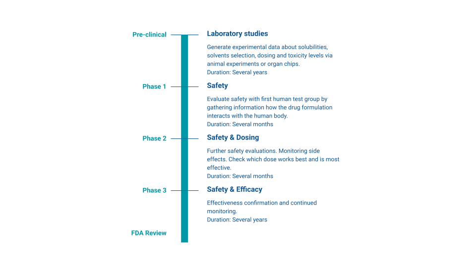

{% assign current_date = 'now' | date: "%Y-%m-%d" %}
{% assign event_start_date = site.event_start_date | date: "%Y-%m-%d" %}
{% assign event_close_date = site.event_close_date | date: "%Y-%m-%d" %}
{% assign registration_opens_date = site.registration_opens_date | date: "%Y-%m-%d" %}
{% assign registration_closes_date = site.registration_closes_date | date: "%Y-%m-%d" %}


    

    

    



    

    

    


## General Context

Bringing new medical products to patients is a long and complex process. Once a
promising compound has been discovered, and its mechanisms of action and potential
efficacy are well understood, it is moved to the clinical trial phase. These phases are split
as follows:

- Phase 1 determines if a drug is safe to use on humans, by targeting multiple dosing regimens. Around 50 patients are in these trials.
- Phase 2 tests the efficacy of therapeutic doses on patients. The goal is to assess if the drug has any efficacy, and its potential side effects. This usually involves a couple of hundred patients.
- Phase 3 determines the effectiveness of the drug at therapeutic doses on a couple of thousands of patients.

The drug can be deployed on the market only after a successful phase 3, after which it will be continuously monitored for long-term side effects. Most drug candidates never make it to the end of Phase 3.

Quantum computers are expected to improve many parts of the pharmaceutical pipeline. They are especially promising for one of the most crucial parts of the pharmaceutical pipeline: drug discovery. Quantum chemistry, protein-ligand docking, and other types of simulations are expected to benefit from upcoming quantum computers, leading to better drug candidates.

However, there is another area where quantum computing may be helpful. While relying on a small amount of data, this area must answer some of the most important and difficult questions: What should be the dosage when switching from animals to human testing? What dosage should participants take in Phase 2 trials, where efficacy is assessed? If the dosage is too low, efficacy will be limited. If the dosage is too high, side effects may become predominant. The scientific field in charge of answering these questions is called pharmacokinetics and pharmacodynamics (PK/PD).

    

## Pharmacokinetics-pharmacodynamics

Pharmacokinetics (PK) and pharmacodynamics (PD) are two related concepts that are used to understand and predict how medicines work in the body:

- Pharmacokinetics (PK): describes how the body interacts with the drug in terms of its absorption, distribution, metabolism, and elimination. It models how drug concentration changes over time in the body.
- Pharmacodynamics (PD): describes how the drug interacts with the body, linking drug concentration to its biological effect. PD models relate the concentration of a drug to the intensity and duration of its effects.
- PK/PD: A combined PK/PD model integrates both aspects; it predicts the time course of drug effects based on the dosing regimen.

PK/PD modeling is generally based on ordinary differential equations (ODEs) to describe both PK and PD models. Existing models are by essence meant to be empirical and interpretable, while providing sufficient variability to simulate and predict drugs behavior under different conditions. These modeling strategies have been used for around 30 years.

Some relevant links for understanding PK/PD:

- [Introduction paper on PK/PD](https://doi.org/10.1111/bcp.13119)
- [A lecture on PK/PD modeling](https://orbit.dtu.dk/en/publications/introduction-to-pkpd-modelling-with-focus-on-pk-and-stochastic-di)
- [Slides introducing the standard PK/PD pipeline (direct pdf link)](https://www.fagg.be/sites/default/files/content/jasper_stevens_pmx101.pdf)

## Alternative Methods

This mechanistic approach has proven effective, and ODE-based models have become prominent in PK/PD. However, this also makes PK/PD labor intensive: they require extensive manual effort, expert knowledge, and many trial-and-errors. Because of the small number of participants in early clinical trial phases, PK/PD modeling is constraint by small sample sizes, limited time points available, and only a few dosing regimens investigated, which limits their accuracy and applicability. Today PK/PD is mechanistic, and hypothesis driven. Several directions have been explored to extend PK/PD. Most attempts at making it more data-driven are based on machine learning (ML), whether through ML techniques [1,2], deep learning[3-7], reinforcement learning [8], agent-based modeling [9.10], and more [1]. In 2021, the FDA mentioned “a new approach to pharmacometrics”, citing a paper showing encouraging results using an LSTM architecture [3]. The method, however, failed at predicting the PD response of drug dosing regimen different than the one used for training. These data-driven approaches have the potential to reduce human supervision and time needed when it comes to model development. They could also help discover new relationships without prior mechanistic knowledge and may be more flexible with more diverse types of data types and covariates.

However, many data-driven approaches are limited by the scarcity of available PK/PD data, which reduces their applicability.

## Innovation Challenge: Quantum Computing for PK/PD

Your challenge, if you wish to accept it, will shine some light on the relevancy of quantum computing methods for PK/PD related problems. Because it is crucial to the pharmaceutical pipeline, and since it relies on early phase clinical trial data, PK/PD could prove to be an interesting and valuable playground for a variety of quantum computing methods.

Quantum machine learning (QML) methods could be a relevant example [11]. A growing body of literature heuristically explores if access to a quantum computer can improve learning algorithms [12-22]. One of the most promising features of quantum machine learning are their expressivity[23-29], trainability[30-39], and generalization[40-55]. This generalization aspect is especially interesting, since QML may help generalize PK/PD models better despite few training data.

Other applications could be within the standard PK/PD modeling process, as it includes differential equations, parameter estimation, bootstrap methods, and other techniques where quantum computing methods may help enhance accuracy and reduce computation time.

No matter the direction taken, creativity is most welcomed, provided that scientific rigor remains the leading principle. The ultimate measure of success lies in the tangible value these quantum computing based solutions can provide to PK/PD.

## Challenge subject

A phase 1 placebo-controlled clinical trial testing three dose levels (1 mg, 3 mg, and 10 mg) of a new compound dosed once daily for three weeks has just been completed. Data from 48 subjects is available (36 on active treatment and 12 on placebo). The subjects weigh between 50 and 100 kg and half of them have also taken some concomitant medication, i.e., another drug. Pharmacokinetic (PK) data (measurements of compound concentration) is available for the subjects randomized to active treatment, and pharmacodynamic (PD) data (measurement of a biomarker) is available for all subjects. Prior knowledge about the structure of a PK-PD model that can describe the observed data is limited, but the data shows that the new compound has a long half-life and that it can suppress the level of the biomarker. The data also shows that the concomitant medication affects the biomarker.

Disclaimer: This dataset is synthetic and has been generated to reflect realistic clinical trial data.

## Tasks to solve

Your task is to develop a quantum-enhanced model to answer the following questions:

- What is the daily dose level (in whole multiples of 0.5 mg) that ensures that 90% of all subjects in a population similar to the one studied in the phase 1 trial achieve suppression of the biomarker below a clinically relevant threshold (3.3 ng/mL) throughout a 24-hour dosing interval at steady-state?
- Which weekly dose level (in whole multiples of 5 mg) has the same effect over a 168-hour dosing interval at steady-state, if the compound was dosed once-weekly?
- Suppose we change the body weight distribution of the population to be treated to 70-140 kg, how does that affect the optimal once-daily and once-weekly doses?
- Suppose we impose the restriction that concomitant medication is not allowed. How does that affect the optimal once-daily and once-weekly doses?
- How much lower would the optimal doses in the above scenarios be if we were to ensure that only 75% of all subjects achieve suppression of the biomarker below the clinically relevant threshold (3.3 ng/mL)?

Note: We will not discriminate based on the type of algorithm and on which infrastructure or processing unit they are run (CPUs, GPUs, QPUs, etc.). This means quantum-inspired methods (e.g., tensor network-based), along with methods from digital or analog quantum computing, quantum annealing, boson sampling, and others are welcome. What matters most are the performance, scalability, and generalizability of the developed methods, along with how early they can demonstrate benefits. The developed method will be assessed by the committee by applying it on new PK/PD datasets.

## Your impact

Your work will bring many new insights on how to improve and expand current PK/PD modelling methods, and on the potential of quantum computing for related applications.

## Standard way of tackling this in PK/PD

A skilled PK/PD modeling scientist could answer these questions within 2 days. The standard way of solving the task involves multiple sequential steps:
- Determine an appropriate model structure for PK (one- or two-compartment model, linear versus nonlinear absorption, linear versus nonlinear elimination…etc.)
- Assess how to best describe the PK variability between subjects using the observed compound concentration data
- Determine an appropriate model structure for PD (linear versus nonlinear response, direct versus indirect response model…etc.)
- Assess how to best describe the PD variability between subjects
- Develop a joint PK/PD model
- Use this PK/PD model to do simulations and help determine what the dose level should be.

Model estimation would be done using a nonlinear mixed effects model estimation algorithm (e.g. using the packages [NONMEM]() or [NLMIXR]()).

## Dataset explanations and metadata

- Dataset shape: 2820 rows x 11 columns
- Dataset columns:
  1. ID: Subject identifier.
  2. BW: Body weight of the subject in kg.
  3. COMED: Concomitant medication indicator for the subject (0: No, 1: Yes)
  4. DOSE: Dose level in mg. This column represents the amount of drug administered to the subject. It is typically measured in units like milligrams (mg) or micrograms (μg). The dose is a critical factor in determining the drug’s pharmacokinetic and pharmacodynamic properties.
  5. TIME: Time in hours. Indicates the time elapsed since the start of the first drug administration. Time is typically measured in hours or minutes and is essential for plotting concentration-time profiles.
  6. DV (Dependent Variable): Compound concentration (mg/L) for DVID=1. Biomarker level (ng/mL) for DVID=2. This column usually represents observed data, such as drug concentration in plasma or another biological matrix. It can also refer to the measurement of a biomarker or response variable affected by the drug, such as blood pressure or heart rate.
  7. EVID (Event ID): This is an event identifier used in NONMEM (a common software in pharmacometrics). It signifies the type of event occurring:
     - EVID = 0 for observation events (e.g., a concentration measurement),
     - EVID = 1 for dosing events.
  8. MDV (Missing Dependent Variable): This value indicates whether the dependent variable (DV) is missing. An MDV of 1 means the DV value is missing, while 0 means it is present.
  9. AMT (Amount): Stands for the actual dose amount administered, especially applicable during infusion dosing. AMT will be zero for observation records.
  10. CMT (Compartment): This denotes the compartment where the event (e.g., dosing or sampling) occurs. In PK models, different compartments (like central and peripheral) help to describe drug kinetics.
  11. DVID (Dependent Variable ID): This identifier helps distinguish between different types of DVs in the dataset. For example, you might have multiple measurement types such as concentrations and biomarkers.

## Bibliography

[1] M. McComb, R. Bies, and M. Ramanathan, “Machine learning in pharmacometrics: Opportunities and challenges,” Br. J. Clin. Pharmacol., vol. 88, no. 4, pp. 1482–1499, Apr. 2022, doi: [10.1111/bcp.14801](https://doi.org/10.1111/bcp.14801).

[2] X. Jia et al., “Application of Machine Learning and Mechanistic Modeling to Predict Intravenous Pharmacokinetic Profiles in Humans,” J. Med. Chem., vol. 68, no. 7, pp. 7737–7750, Apr. 2025, doi: [10.1021/acs.jmedchem.5c00340](https://doi.org/10.1021/acs.jmedchem.5c00340).

[3] X. Liu et al., “Long short-term memory recurrent neural network for pharmacokinetic- pharmacodynamic modeling,” Int J. Clin. Pharmacol. Ther., vol. 59, no. 02, pp. 138–146, Feb. 2021, doi: [10.5414/CP203800](https://doi.org/10.5414/CP203800).

[4] C. Liu, Y. Xu, Q. Liu, H. Zhu, and Y. Wang, “Application of machine learning based methods in exposure–response analysis,” J. Pharmacokinet. Pharmacodyn., vol. 49, no. 4, pp. 401–410, Aug. 2022, doi: [10.1007/s10928-022-09802-2](https://doi.org/10.1007/s10928-022-09802-2).

[5] G. Liu, L. Brooks, J. Canty, D. Lu, J. Y. Jin, and J. Lu, “Deep-NCA: A deep learning methodology for performing noncompartmental analysis of pharmacokinetic data,” CPT Pharmacomet. Syst. Pharmacol., vol. 13, no. 5, pp. 870–879, May 2024, doi: [10.1002/psp4.13124](https://doi.org/10.1002/psp4.13124).

[6] J. Lu, B. Bender, J. Y. Jin, and Y. Guan, “Deep learning prediction of patient response time course from early data via neural-pharmacokinetic/pharmacodynamic modelling,” Nat. Mach. Intell., vol. 3, no. 8, pp. 696–704, Jun. 2021, doi: [10.1038/s42256-021-00357-4](https://doi.org/10.1038/s42256-021-00357-4).

[7] A. Tang, “Machine Learning for Pharmacokinetic/Pharmacodynamic Modeling,” J. Pharm. Sci., vol. 112, no. 5, pp. 1460–1475, May 2023, doi: [10.1016/j.xphs.2023.01.010](https://doi.org/10.1016/j.xphs.2023.01.010).

[8] B. Ribba, S. Dudal, T. Lavé, and R. W. Peck, “Model-Informed Artificial Intelligence: Reinforcement Learning for Precision Dosing,” Clin. Pharmacol. Ther., vol. 107, no. 4, pp. 853–857, Apr. 2020, doi: [10.1002/cpt.1777](https://doi.org/10.1002/cpt.1777).

[9] P. Bloomingdale, V. A. Nguyen, J. Niu, and D. E. Mager, “Boolean network modeling in systems pharmacology,” J. Pharmacokinet. Pharmacodyn., vol. 45, no. 1, pp. 159–180, Feb. 2018, doi: [10.1007/s10928-017-9567-4](https://doi.org/10.1007/s10928-017-9567-4).

[10] J. Cosgrove et al., “Agent-Based Modeling in Systems Pharmacology: Agent-Based Modeling in Systems Pharmacology,” CPT Pharmacomet. Syst. Pharmacol., vol. 4, no. 11, pp. 615–629, Nov. 2015, doi: [10.1002/psp4.12018](https://doi.org/10.1002/psp4.12018).

[11] E. Gil-Fuster, J. Eisert, and C. Bravo-Prieto, “Understanding quantum machine learning also requires rethinking generalization,” Nat. Commun., vol. 15, no. 1, p. 2277, Mar. 2024, doi: [10.1038/s41467-024-45882-z](https://doi.org/10.1038/s41467-024-45882-z).

[12] M. Schuld, M. Fingerhuth, and F. Petruccione, “Implementing a distance-based classifier with a quantum interference circuit,” EPL Europhys. Lett., vol. 119, no. 6, p. 60002, Sep. 2017, doi: [10.1209/0295-5075/119/60002](https://doi.org/10.1209/0295-5075/119/60002).

[13] V. Havlíček et al., “Supervised learning with quantum-enhanced feature spaces,” Nat. 2019 5677747, vol. 567, no. 7747, Mar. 2019, doi: [10.1038/s41586-019-0980-2](https://doi.org/10.1038/s41586-019-0980-2).

[14] M. Schuld and N. Killoran, “Quantum Machine Learning in Feature Hilbert Spaces,” Phys. Rev. Lett., vol. 122, no. 4, p. 040504, Feb. 2019, doi: [10.1103/PhysRevLett.122.040504](https://doi.org/10.1103/PhysRevLett.122.040504).

[15] M. Benedetti, D. Garcia-Pintos, O. Perdomo, V. Leyton-Ortega, Y. Nam, and A. Perdomo-Ortiz, “A generative modeling approach for benchmarking and training shallow quantum circuits,” Npj Quantum Inf., vol. 5, no. 1, p. 45, May 2019, doi: [10.1038/s41534-019-0157-8](https://doi.org/10.1038/s41534-019-0157-8).

[16] D. Zhu et al., “Training of quantum circuits on a hybrid quantum computer,” Sci. Adv., vol. 5, no. 10, p. eaaw9918, Oct. 2019, doi: [10.1126/sciadv.aaw9918](https://doi.org/10.1126/sciadv.aaw9918).

[17] A. Pérez-Salinas, A. Cervera-Lierta, E. Gil-Fuster, and J. I. Latorre, “Data re-uploading for a universal quantum classifier,” Quantum, vol. 4, p. 226, Feb. 2020, doi: [10.22331/q-2020-02- 06-226](https://doi.org/10.22331/q-2020-02- 06-226).

[18] B. Coyle, D. Mills, V. Danos, and E. Kashefi, “The Born supremacy: quantum advantage and training of an Ising Born machine,” Npj Quantum Inf., vol. 6, no. 1, p. 60, Jul. 2020, doi: [10.1038/s41534-020-00288-9](https://doi.org/10.1038/s41534-020-00288-9).

[19] S. Lloyd, M. Schuld, A. Ijaz, J. Izaac, and N. Killoran, “Quantum embeddings for machine learning,” 2020, arXiv. doi: [10.48550/ARXIV.2001.03622](https://doi.org/10.48550/ARXIV.2001.03622).

[20] T. Hubregtsen, D. Wierichs, E. Gil-Fuster, P.-J. H. S. Derks, P. K. Faehrmann, and J. J. Meyer, “Training quantum embedding kernels on near-term quantum computers,” Phys. Rev. A, vol. 106, no. 4, p. 042431, Oct. 2022, doi: [10.1103/PhysRevA.106.042431](https://doi.org/10.1103/PhysRevA.106.042431).

[21] M. S. Rudolph, N. B. Toussaint, A. Katabarwa, S. Johri, B. Peropadre, and A. Perdomo-Ortiz, “Generation of High-Resolution Handwritten Digits with an Ion-Trap Quantum Computer,” Phys. Rev. X, vol. 12, no. 3, p. 031010, Jul. 2022, doi: [10.1103/PhysRevX.12.031010](https://doi.org/10.1103/PhysRevX.12.031010).

[22] C. Bravo-Prieto, J. Baglio, M. Cè, A. Francis, D. M. Grabowska, and S. Carrazza, “Style-based quantum generative adversarial networks for Monte Carlo events,” Quantum, vol. 6, p. 777, Aug. 2022, doi: [10.22331/q-2022-08-17-777](https://doi.org/10.22331/q-2022-08-17-777).

[23] S. Sim, P. D. Johnson, and A. Aspuru-Guzik, “Expressibility and Entangling Capability of Parameterized Quantum Circuits for Hybrid Quantum-Classical Algorithms,” Adv. Quantum Technol., vol. 2, no. 12, p. 1900070, Dec. 2019, doi: [10.1002/qute.201900070](https://doi.org/10.1002/qute.201900070).

[24] C. Bravo-Prieto, J. Lumbreras-Zarapico, L. Tagliacozzo, and J. I. Latorre, “Scaling of variational quantum circuit depth for condensed matter systems,” Quantum, vol. 4, p. 272, May 2020, doi: [10.22331/q-2020-05-28-272](https://doi.org/10.22331/q-2020-05-28-272).

[25] Y. Wu, J. Yao, P. Zhang, and H. Zhai, “Expressivity of quantum neural networks,” Phys. Rev. Res., vol. 3, no. 3, p. L032049, Aug. 2021, doi: [10.1103/PhysRevResearch.3.L032049](https://doi.org/10.1103/PhysRevResearch.3.L032049).

[26] D. Herman, R. Raymond, M. Li, N. Robles, A. Mezzacapo, and M. Pistoia, “Expressivity of Variational Quantum Machine Learning on the Boolean Cube,” IEEE Trans. Quantum Eng., vol. 4, pp. 1–18, 2023, doi: [10.1109/TQE.2023.3255206](https://doi.org/10.1109/TQE.2023.3255206).

[27] T. Hubregtsen, J. Pichlmeier, P. Stecher, and K. Bertels, “Evaluation of parameterized quantum circuits: on the relation between classification accuracy, expressibility, and entangling capability,” Quantum Mach. Intell., vol. 3, no. 1, p. 9, Jun. 2021, doi: [10.1007/s42484-021-00038-w](https://doi.org/10.1007/s42484-021-00038-w).

[28] T. Haug, K. Bharti, and M. S. Kim, “Capacity and Quantum Geometry of Parametrized Quantum Circuits,” PRX Quantum, vol. 2, no. 4, p. 040309, Oct. 2021, doi: [10.1103/PRXQuantum.2.040309](https://doi.org/10.1103/PRXQuantum.2.040309).

[29] Z. Holmes, K. Sharma, M. Cerezo, and P. J. Coles, “Connecting Ansatz Expressibility to Gradient Magnitudes and Barren Plateaus,” PRX Quantum, vol. 3, no. 1, p. 010313, Jan. 2022, doi: [10.1103/PRXQuantum.3.010313](https://doi.org/10.1103/PRXQuantum.3.010313).

[30] J. R. McClean, S. Boixo, V. N. Smelyanskiy, R. Babbush, and H. Neven, “Barren plateaus in quantum neural network training landscapes,” Nat. Commun., vol. 9, no. 1, p. 4812, Nov. 2018, doi: [10.1038/s41467-018-07090-4](https://doi.org/10.1038/s41467-018-07090-4).

[31] M. Cerezo, A. Sone, T. Volkoff, L. Cincio, and P. J. Coles, “Cost function dependent barren plateaus in shallow parametrized quantum circuits,” Nat. Commun., vol. 12, no. 1, p. 1791, Mar. 2021, doi: [10.1038/s41467-021-21728-w](https://doi.org/10.1038/s41467-021-21728-w).

[32] A. Arrasmith, M. Cerezo, P. Czarnik, L. Cincio, and P. J. Coles, “Effect of barren plateaus on gradient-free optimization,” Quantum, vol. 5, p. 558, Oct. 2021, doi: [10.22331/q-2021-10-05-558](https://doi.org/10.22331/q-2021-10-05-558).

[33] J. Kim, J. Kim, and D. Rosa, “Universal effectiveness of high-depth circuits in variational eigenproblems,” Phys. Rev. Res., vol. 3, no. 2, p. 023203, Jun. 2021, doi: [10.1103/PhysRevResearch.3.023203](https://doi.org/10.1103/PhysRevResearch.3.023203).

[34] S. Wang et al., “Noise-induced barren plateaus in variational quantum algorithms,” Nat. Commun., vol. 12, no. 1, p. 6961, Nov. 2021, doi: [10.1038/s41467-021-27045-6](https://doi.org/10.1038/s41467-021-27045-6).

[35] A. Pesah, M. Cerezo, S. Wang, T. Volkoff, A. T. Sornborger, and P. J. Coles, “Absence of Barren Plateaus in Quantum Convolutional Neural Networks,” Phys. Rev. X, vol. 11, no. 4, p. 041011, Oct. 2021, doi: [10.1103/PhysRevX.11.041011](https://doi.org/10.1103/PhysRevX.11.041011).

[36] C. Ortiz Marrero, M. Kieferová, and N. Wiebe, “Entanglement-Induced Barren Plateaus,” PRX Quantum, vol. 2, no. 4, p. 040316, Oct. 2021, doi: [10.1103/PRXQuantum.2.040316](https://doi.org/10.1103/PRXQuantum.2.040316).

[37] M. Larocca, N. Ju, D. García-Martín, P. J. Coles, and M. Cerezo, “Theory of overparametrization in quantum neural networks,” Nat. Comput. Sci., vol. 3, no. 6, pp. 542–551, Jun. 2023, doi: [10.1038/s43588-023-00467-6](https://doi.org/10.1038/s43588-023-00467-6).

[38] K. Sharma, M. Cerezo, L. Cincio, and P. J. Coles, “Trainability of Dissipative Perceptron-Based Quantum Neural Networks,” Phys. Rev. Lett., vol. 128, no. 18, p. 180505, May 2022, doi: [10.1103/PhysRevLett.128.180505](https://doi.org/10.1103/PhysRevLett.128.180505).

[39] M. S. Rudolph et al., “Trainability barriers and opportunities in quantum generative modeling,” 2023, arXiv. doi: [10.48550/ARXIV.2305.02881](https://doi.org/10.48550/ARXIV.2305.02881).

[40] M. C. Caro and I. Datta, “Pseudo-dimension of quantum circuits,” Quantum Mach. Intell., vol. 2, no. 2, p. 14, Dec. 2020, doi: [10.1007/s42484-020-00027-5](https://doi.org/10.1007/s42484-020-00027-5).

[41] A. Abbas, D. Sutter, C. Zoufal, A. Lucchi, A. Figalli, and S. Woerner, “The power of quantum neural networks,” Nat. Comput. Sci., vol. 1, no. 6, pp. 403–409, Jun. 2021, doi: [10.1038/s43588-021-00084-1](https://doi.org/10.1038/s43588-021-00084-1).

[42] L. Banchi, J. Pereira, and S. Pirandola, “Generalization in Quantum Machine Learning: A Quantum Information Standpoint,” PRX Quantum, vol. 2, no. 4, p. 040321, Nov. 2021, doi: [10.1103/PRXQuantum.2.040321](https://doi.org/10.1103/PRXQuantum.2.040321).

[43] K. Bu, D. E. Koh, L. Li, Q. Luo, and Y. Zhang, “Effects of quantum resources and noise on the statistical complexity of quantum circuits,” Quantum Sci. Technol., vol. 8, no. 2, p. 025013, Apr. 2023, doi: [10.1088/2058-9565/acb56a](https://doi.org/10.1088/2058-9565/acb56a).

[44] K. Bu, D. E. Koh, L. Li, Q. Luo, and Y. Zhang, “Rademacher complexity of noisy quantum circuits,” 2021, arXiv. doi: [10.48550/ARXIV.2103.03139](https://doi.org/10.48550/ARXIV.2103.03139).

[45] K. Bu, D. E. Koh, L. Li, Q. Luo, and Y. Zhang, “Statistical complexity of quantum circuits,” Phys. Rev. A, vol. 105, no. 6, p. 062431, Jun. 2022, doi: [10.1103/PhysRevA.105.062431](https://doi.org/10.1103/PhysRevA.105.062431).

[46] Y. Du, Z. Tu, X. Yuan, and D. Tao, “Efficient Measure for the Expressivity of Variational Quantum Algorithms,” Phys. Rev. Lett., vol. 128, no. 8, p. 080506, Feb. 2022, doi: [10.1103/PhysRevLett.128.080506](https://doi.org/10.1103/PhysRevLett.128.080506).

[47] C. Gyurik, D. Vreumingen, Van, and V. Dunjko, “Structural risk minimization for quantum linear classifiers,” Quantum, vol. 7, p. 893, Jan. 2023, doi: [10.22331/q-2023-01-13-893](https://doi.org/10.22331/q-2023-01-13-893).

[48] M. C. Caro, E. Gil-Fuster, J. J. Meyer, J. Eisert, and R. Sweke, “Encoding-dependent generalization bounds for parametrized quantum circuits,” Quantum, vol. 5, p. 582, Nov. 2021, doi: [10.22331/q-2021-11-17-582](https://doi.org/10.22331/q-2021-11-17-582).

[49] M. C. Caro et al., “Generalization in quantum machine learning from few training data,” Nat.
Commun., vol. 13, no. 1, p. 4919, Aug. 2022, doi: [10.1038/s41467-022-32550-3](https://doi.org/10.1038/s41467-022-32550-3).

[50] M. C. Caro et al., “Out-of-distribution generalization for learning quantum dynamics,” Nat. Commun., vol. 14, no. 1, p. 3751, Jul. 2023, doi: [10.1038/s41467-023-39381-w](https://doi.org/10.1038/s41467-023-39381-w).

[51] Y. Qian, X. Wang, Y. Du, X. Wu, and D. Tao, “The Dilemma of Quantum Neural Networks,” IEEE Trans. Neural Netw. Learn. Syst., vol. 35, no. 4, pp. 5603–5615, Apr. 2024, doi: [10.1109/TNNLS.2022.3208313](https://doi.org/10.1109/TNNLS.2022.3208313).

[52] Y. Du, Y. Yang, D. Tao, and M.-H. Hsieh, “Problem-Dependent Power of Quantum Neural Networks on Multiclass Classification,” Phys. Rev. Lett., vol. 131, no. 14, p. 140601, Oct. 2023, doi: [10.1103/PhysRevLett.131.140601](https://doi.org/10.1103/PhysRevLett.131.140601).

[53] L. Schatzki, M. Larocca, Q. T. Nguyen, F. Sauvage, and M. Cerezo, “Theoretical guarantees for permutation-equivariant quantum neural networks,” Npj Quantum Inf., vol. 10, no. 1, p. 12, Jan. 2024, doi: [10.1038/s41534-024-00804-1](https://doi.org/10.1038/s41534-024-00804-1).

[54] E. Peters and M. Schuld, “Generalization despite overfitting in quantum machine learning models,” Quantum, vol. 7, p. 1210, Dec. 2023, doi: [10.22331/q-2023-12-20-1210](https://doi.org/10.22331/q-2023-12-20-1210).

[55] T. Haug and M. S. Kim, “Generalization of Quantum Machine Learning Models Using Quantum Fisher Information Metric,” Phys. Rev. Lett., vol. 133, no. 5, p. 050603, Jul. 2024, doi: [10.1103/PhysRevLett.133.050603](https://doi.org/10.1103/PhysRevLett.133.050603).

# Quantum Challenge 2025 Projects

Find below the links for each of the projects. This list will be updated on an ongoing basis to track the submitted projects. For details on how to submit a project, see the [submission page](_/../submission.md).
